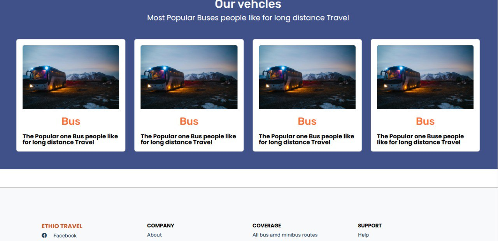
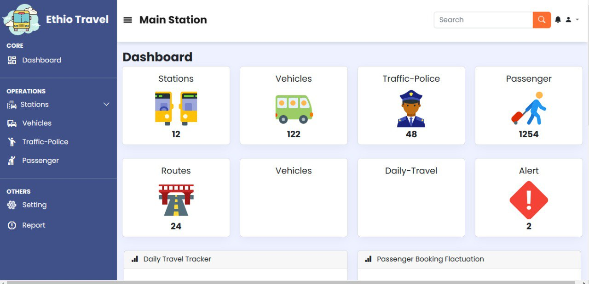
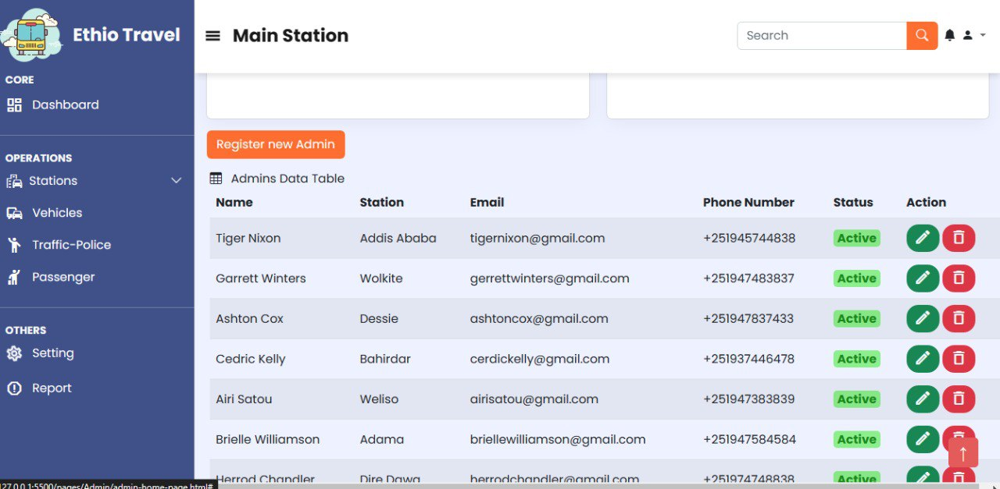
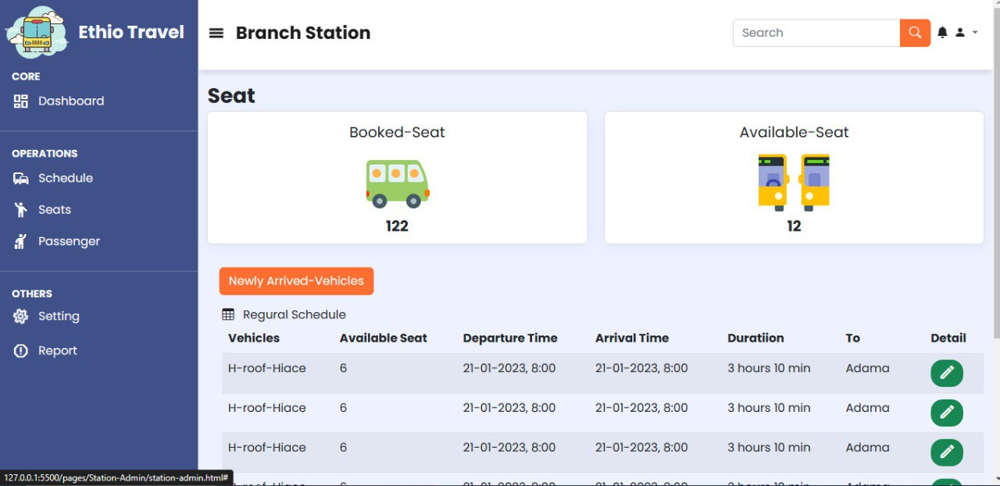

# IP-Project-Bus-Station-Management-System
This project is Internet Programming course project; with HTML,CSS,JavaScript,PHP and Bootstrap-5 s as a front-end frame work

### Bus-Station-Management-System

---

## 👉 Requirements

- HTML5
- CSS3
- JavaScript
- Bootstrap5

👉 Sample screenshots taken

 

 

 

 

 
